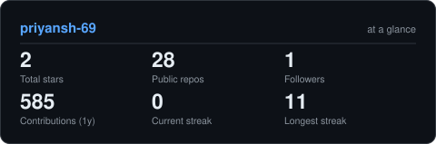

<!-- Typing Headline -->

  

<!-- Connect Links & Status -->

&nbsp;

&nbsp;

&nbsp;

  

&nbsp;

  

<!-- Self-Hosted Statistics -->
<picture>
  <source media="(prefers-color-scheme: dark)" srcset="assets/card-stats-dark.svg">
  <source media="(prefers-color-scheme: light)" srcset="assets/card-stats-light.svg">
  
</picture>

 

---

### 🚀 Overview & Focus

- 🔭 **Architecting**: Distributed systems, full-stack web applications, and observability pipelines.
- 🛠️ **Open Source**: Contributor to **[opensre](https://github.com/Tracer-Cloud/opensre)** (AI SRE diagnostic toolkit) and author of **[sre-watchdog](https://github.com/priyansh-69/sre-watchdog)**.
- 💬 **Core Interests**: Backend security (RBAC/JWT), microservices, high-throughput APIs, and data structures in Java.

 

---

### ⚡ Technical Stack

  

&nbsp;

&nbsp;

&nbsp;

&nbsp;

&nbsp;

 

---

### 📂 Featured Projects

| Project | Description | Stack |
| :--- | :--- | :--- |
| **[opensre](https://github.com/Tracer-Cloud/opensre)** | Open-source Site Reliability Engineering toolsuite & AI incident diagnostics. | `Python` `SRE` `Telemetry` |
| **[sre-watchdog](https://github.com/priyansh-69/sre-watchdog)** | Proactive uptime sentinel & health telemetry monitor for distributed nodes. | `Python` `Observability` `Uptime` |
| **[RBAC-otp-backend-e2e](https://github.com/priyansh-69/RBAC-otp-backend-e2e)** | Role-based access control authentication microservice with JWT & OTP verification. | `Node.js` `Express` `Security` |
| **[forge-app](https://github.com/priyansh-69/forge-app)** | Modern full-stack application workspace with modular component architecture. | `React` `TypeScript` `Tailwind` |

 

---

  
    Designed with precision · <b>Priyansh Kandwal</b> · <a href="https://github.com/priyansh-69?tab=repositories">Explore all 28 repositories ↗</a>
  

