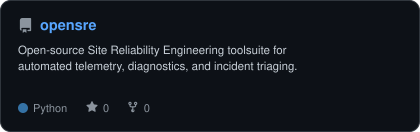
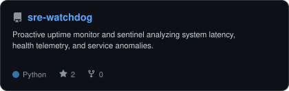
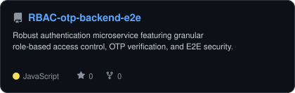
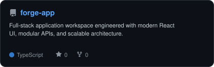

<!-- Typing Headline -->

  

<!-- Technical Arsenal -->
<h3>⚡ Technical Arsenal</h3>

  

<!-- Specialized Framework Badges -->

&nbsp;

&nbsp;

&nbsp;

&nbsp;

&nbsp;

  

<!-- Connect with Me -->
<h3>🤝 Connect with Me</h3>

&nbsp;

&nbsp;

&nbsp;

  

  

<!-- Self-Hosted GitHub Statistics -->
<picture>
  <source media="(prefers-color-scheme: dark)" srcset="assets/card-stats-dark.svg">
  <source media="(prefers-color-scheme: light)" srcset="assets/card-stats-light.svg">
  
</picture>

  

 

---

### `~/` whoami

- 🚀 **Focus**: Full-Stack Architecture, Site Reliability Engineering, and Distributed Systems.
- 🛠️ **Active Work**: Contributing to open-source diagnostics at **[opensre](https://github.com/Tracer-Cloud/opensre)** and building health sentinels like **[sre-watchdog](https://github.com/priyansh-69/sre-watchdog)**.
- ⚡ **Core Arsenal**: Node.js, Express, TypeScript, React, MongoDB, Redis, Docker, and algorithms in Java.

 

---

### `~/` featured projects

<table align="center" width="100%">
  <tr>
    <td width="50%" align="center" valign="top">
      <a href="https://github.com/Tracer-Cloud/opensre">
        <picture>
          <source media="(prefers-color-scheme: dark)" srcset="assets/card-opensre-dark.svg">
          <source media="(prefers-color-scheme: light)" srcset="assets/card-opensre-light.svg">
          
        </picture>
      </a>
       
      <code>SRE</code> · <code>Telemetry</code> · <code>Python</code> · <code>Diagnostics</code>
    </td>
    <td width="50%" align="center" valign="top">
      <a href="https://github.com/priyansh-69/sre-watchdog">
        <picture>
          <source media="(prefers-color-scheme: dark)" srcset="assets/card-sre-watchdog-dark.svg">
          <source media="(prefers-color-scheme: light)" srcset="assets/card-sre-watchdog-light.svg">
          
        </picture>
      </a>
       
      <code>Health Sentinel</code> · <code>Uptime</code> · <code>Python</code> · <code>Observability</code>
    </td>
  </tr>
  <tr>
    <td width="50%" align="center" valign="top">
      <a href="https://github.com/priyansh-69/RBAC-otp-backend-e2e">
        <picture>
          <source media="(prefers-color-scheme: dark)" srcset="assets/card-RBAC-otp-backend-e2e-dark.svg">
          <source media="(prefers-color-scheme: light)" srcset="assets/card-RBAC-otp-backend-e2e-light.svg">
          
        </picture>
      </a>
       
      <code>Auth Microservice</code> · <code>RBAC</code> · <code>JWT & OTP</code> · <code>Node/Express</code>
    </td>
    <td width="50%" align="center" valign="top">
      <a href="https://github.com/priyansh-69/forge-app">
        <picture>
          <source media="(prefers-color-scheme: dark)" srcset="assets/card-forge-app-dark.svg">
          <source media="(prefers-color-scheme: light)" srcset="assets/card-forge-app-light.svg">
          
        </picture>
      </a>
       
      <code>Full-Stack App</code> · <code>React</code> · <code>TypeScript</code> · <code>Modular UI</code>
    </td>
  </tr>
</table>

 

---

### `~/` skill & language telemetry

<table align="center" width="100%">
  <tr>
    <td width="50%" align="center" valign="top">
      <b>Skill Distribution (Self-Assessed)</b>  
      <picture>
        <source media="(prefers-color-scheme: dark)" srcset="assets/radar-dark.svg">
        <source media="(prefers-color-scheme: light)" srcset="assets/radar-light.svg">
        
      </picture>
    </td>
    <td width="50%" align="center" valign="top">
      <b>Repository Byte Count (Live GitHub API)</b>  
      <picture>
        <source media="(prefers-color-scheme: dark)" srcset="assets/radar-langs-dark.svg">
        <source media="(prefers-color-scheme: light)" srcset="assets/radar-langs-light.svg">
        
      </picture>
    </td>
  </tr>
</table>

 

---

  
    Designed with precision · Rebuilt daily via GitHub Actions · <b>Priyansh Kandwal</b>
  

